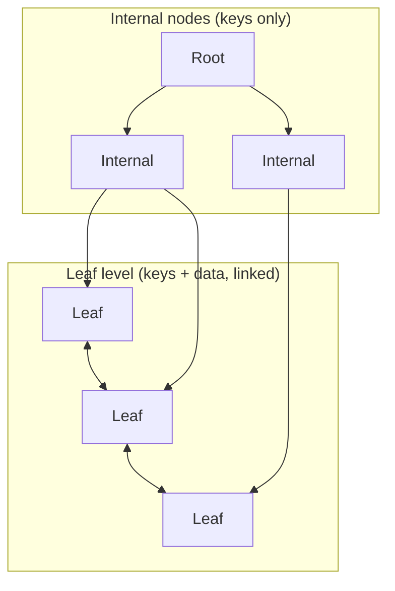

# B-Trees and B+ Trees

B-Trees (and especially **B+ Trees**) are the default index structure for on-disk and page-oriented storage. They optimize for **minimal I/O** and **ordered range access**.

> **Scope:** **Conceptual lens** — B-tree/B+ tree structure, page-oriented reads, range scans. PostgreSQL index DDL and partial/covering indexes → [postgresql-performance §2 Indexing](../../postgresql-performance/includes/02-indexing.md). Write-heavy alternative → [§4 LSM trees](04-lsm-trees.md).
>
> **Related:** PostgreSQL B-tree, partial, and covering indexes → [postgresql-performance/includes/02-indexing.md](../../postgresql-performance/includes/02-indexing.md)

---

## B-Tree

- Each node holds **keys + child pointers** (and often values in leaf/internal nodes).
- All leaves at the same depth; nodes are **wide** (hundreds/thousands of keys) to match **page size** (4–16 KB).
- Minimum fill ~50% after splits; height stays **O(log n)** with a **large branching factor**.

## B+ Tree (what most databases use)

- **Keys only in internal nodes**; **all data in leaves**.
- Leaves linked in a **doubly linked list** → efficient range scans.
- Internal nodes are smaller (keys only) → **higher fanout**, **shallower tree**.

---

## Pros

| Advantage | Why it matters |
|-----------|----------------|
| **Minimal I/O** | One node ≈ one disk/SSD page → few seeks per lookup |
| **Predictable performance** | Rebalancing on insert/delete; no degenerate linked-list shape |
| **Range scans (B+)** | Walk leaf chain instead of re-descending the tree |
| **Cache-friendly** | Node size aligned with page/block size |

## Cons

| Disadvantage | Why it matters |
|--------------|----------------|
| **Complex implementation** | Splits, merges, rebalancing, concurrency, WAL(Write-Ahead Log) |
| **Poor for tiny datasets in RAM** | Pointer + page overhead |
| **Not ideal for prefix search** | Use trie/radix for string prefixes |
| **Point lookups are O(log n)** | Not O(1) like a hash table |

---

## When to use

- **On-disk or page-oriented storage**: PostgreSQL, MySQL InnoDB, SQLite, MongoDB indexes.
- **Ordered data + range queries**: `WHERE id BETWEEN ...`, `ORDER BY`, pagination.
- **Secondary indexes** where sorting and scanning matter.

---

## B+ Tree vs hash index

| | B+ Tree | Hash |
|--|---------|------|
| Point lookup | O(log n) I/O | O(1) average |
| Range / ORDER BY | ✅ | ❌ |
| Prefix search | Partial (by key order) | ❌ |
| On-disk friendly | ✅ | Harder |

**Use hash** for equality-only lookups. **Use B+** when order and ranges matter.

---

## Why B+ trees dominate databases

Disks and SSDs read in **blocks/pages**, not single keys. A B+ tree with fanout 500 and height 3 can index **~125 million keys** with at most **3 random I/Os** per lookup. A binary tree would need ~27 levels for the same count — unusable on disk. Linking leaves makes **range scans** (reports, indexes on `(timestamp, id)`) cheap.

**Rule of thumb:** If one node ≈ one I/O unit → **B+ Tree**.

---

## Clustered vs secondary index

In engines like **InnoDB**, the **clustered index** leaf stores the full row; **secondary indexes** store index keys plus a pointer to the clustered key — often **two tree lookups** per read.

- Choose primary keys deliberately — they define physical order.
- Prefer **covering indexes** when a secondary index serves hot read queries.
- Avoid many wide secondary indexes on write-heavy tables.

## Common mistakes

| Mistake | Fix |
|---------|-----|
| Hash index when queries need `ORDER BY` | B+ tree for range and sort |
| B+ tree for equality-only at huge scale | Consider hash where engine supports it |
| Ignore clustered index choice (InnoDB) | Primary key defines physical order |
| Secondary index without covering columns | Extra heap lookups on hot reads |
| Wrong structure for write-heavy KV at scale | See [§4 LSM trees](04-lsm-trees.md) |

Full detail → [06-amplification-and-related-topics.md](06-amplification-and-related-topics.md#clustered-vs-secondary-index-b-tree-engines)
