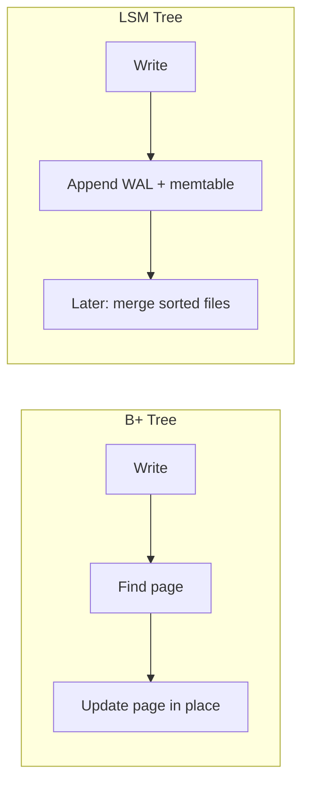

# LSM(Log-Structured Merge) Trees (Log-Structured Merge Trees)

LSM trees are the main alternative to **B+ trees** for **write-heavy, append-friendly** storage. They trade **write amplification and read complexity** for **fast sequential writes** and high **ingest throughput**.

> **Related:** Read/write/space amplification → [06-amplification-and-related-topics.md](06-amplification-and-related-topics.md#amplification-framework-b-vs-lsm)

---

## What an LSM tree is

An LSM tree is not one tree in memory — it is a **tiered system**:

1. **Write-ahead log (WAL(Write-Ahead Log))** — durability before the write is accepted
2. **Memtable** — in-memory sorted structure (often a **skip list** or red-black tree)
3. **Immutable SSTables** — sorted **S**orted **S**tring **Table** files on disk, organized in **levels**
4. **Compaction** — background merge of SSTables to limit file count and reclaim space

### Write path

### Read path

Check memtable → older memtables → L0 SSTables → deeper levels. **Bloom filters** and **sparse indexes** skip files that cannot contain the key.

---

## Core components

| Component | Role |
|-----------|------|
| **Memtable** | Absorbs writes in RAM; sorted for flush |
| **WAL(Write-Ahead Log)** | Crash recovery if memtable not yet flushed |
| **SSTable** | Immutable on-disk sorted runs; no in-place updates |
| **Bloom filter** | “Key probably not in this file” → skip I/O |
| **Compaction** | Merge overlapping files; drop deleted/tombstoned keys |

---

## Updates and deletes

LSM stores are **append-only**:

- **Update** = new entry with same key (newer wins by sequence/timestamp)
- **Delete** = **tombstone** marker; removed during compaction when older versions merge away

No random disk writes to change a page — the main win vs B+ trees.

---

## Compaction strategies

| Strategy | Idea | Tradeoff |
|----------|------|----------|
| **Size-tiered (STCS)** | Merge similar-sized files | Write-friendly; more read amplification |
| **Leveled (LCS)** | Non-overlapping key ranges per level | Better reads; more write amplification |
| **Universal / hybrid** | Mix of both | Tunable (RocksDB, Cassandra options) |

---

## Pros

| Advantage | Why |
|-----------|-----|
| **Fast writes** | Sequential WAL + memtable; flush is sequential I/O |
| **High ingest** | Logs, metrics, time-series, event streams |
| **SSD-friendly** | Large sequential writes; less random in-place mutation |
| **Natural versioning** | Same key, multiple versions (MVCC(Multi-Version Concurrency Control)-style stores) |
| **Horizontal scale** | Immutable SSTables replicate and ship cleanly |

## Cons

| Disadvantage | Why |
|--------------|-----|
| **Read amplification** | May check memtable + many SSTables + Bloom false positives |
| **Write amplification** | Compaction rewrites data multiple times |
| **Space amplification** | Overlapping L0 files, tombstones, duplicates until compaction |
| **Compaction stalls** | Heavy compaction → latency spikes if not tuned |
| **Delayed space reclaim** | Deletes visible only after compaction |
| **Range scan cost** | Worse than B+ leaf chain unless leveled + well compacted |
| **Operational tuning** | Memtable size, level ratios, compaction threads matter |

---

## LSM vs B+ Tree

| Dimension | B+ Tree (InnoDB, Postgres) | LSM Tree (RocksDB, Cassandra) |
|-----------|----------------------------|--------------------------------|
| **Random write** | Updates pages in place → random I/O | Append → sequential |
| **Point read** | O(log n) pages, predictable | Memtable + filters + maybe many files |
| **Range scan** | Strong (linked leaves) | OK with leveled compaction; weaker at L0 |
| **Write throughput** | Moderate | Very high |
| **Read latency (steady)** | Usually lower, stable | Can spike (compaction, L0 overlap) |
| **Space after delete** | Faster reclaim (VACUUM, etc.) | Delayed until compaction |
| **Transactions / SQL(Structured Query Language)** | Native fit | Often KV or wide-column layer on top |
| **Flash wear** | More random writes | More total bytes written (amplification) |

---

## When to use LSM

**Good fits:**

- **Write-heavy workloads** — IoT, metrics, logs, clickstreams
- **Key-value / wide-column at scale** — Cassandra, Scylla, HBase
- **Embedded engines** — RocksDB, LevelDB (MyRocks, Kafka Streams state, etc.)
- **Time-series** — append + TTL + compaction (often with time partitioning)
- **Cloud/distributed** — immutable SSTables replicate cleanly

**Poor fits:**

- **Read-heavy, latency-sensitive** point + range with few writes — B+ often wins
- **Heavy UPDATE same row** — versions/tombstones increase amplification
- **Immediate delete + space reclaim** — needs compaction policy + monitoring
- **Full SQL with ad-hoc range joins** — B+ tree engines remain the default

---

## Where you see LSM in the wild

| System | Role |
|--------|------|
| **RocksDB** | Library; leveled/universal compaction |
| **LevelDB** | Google's original embedded LSM |
| **Cassandra / Scylla** | SSTables + compaction (STCS/LCS) |
| **HBase** | SSTables on HDFS |
| **Badger** | Go KV (LSM + value log) |
| **MyRocks** | MySQL on RocksDB instead of InnoDB |

B+ tree systems: **PostgreSQL**, **MySQL InnoDB**, **SQLite**, most traditional RDBMS indexes.

---

## Mental model: B+ vs LSM

- **B+ tree:** optimize **read + ordered scan** with minimal layers
- **LSM:** optimize **write throughput** by **batching sort + merge** in the background

---

## Tuning levers

- Memtable size and count
- Compaction strategy (leveled vs size-tiered)
- Bloom filter bits per key
- Block cache and OS page cache
- Time partitioning for TTL (drop whole SSTables)
- Rate limits on compaction to avoid latency spikes

## Common mistakes

| Mistake | Fix |
|---------|-----|
| LSM for read-heavy OLTP with range queries | B+ tree engine (PostgreSQL, InnoDB) |
| Ignore compaction stall alerts | Tune threads; rate-limit compaction |
| Tiny memtable on write-heavy ingest | Increase memtable size; monitor L0 |
| Deletes expected to free space immediately | Plan compaction + tombstone policy |
| Single-node RocksDB without backup plan | Snapshot + replication strategy |
