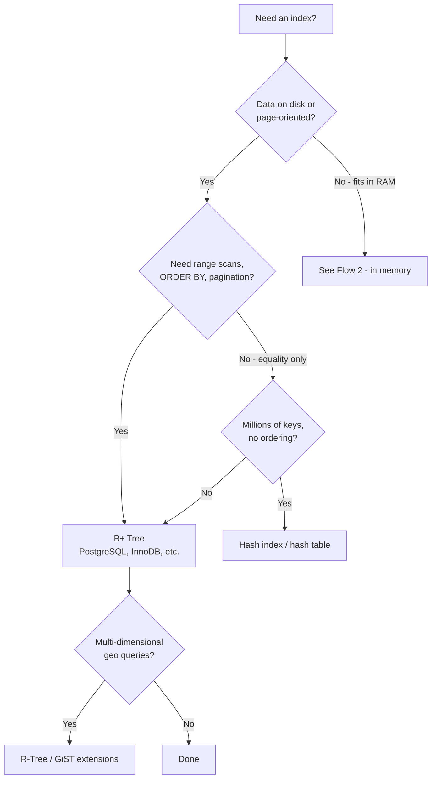
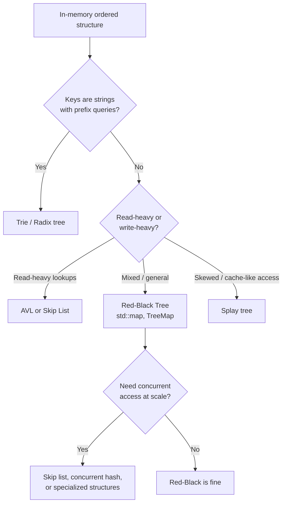
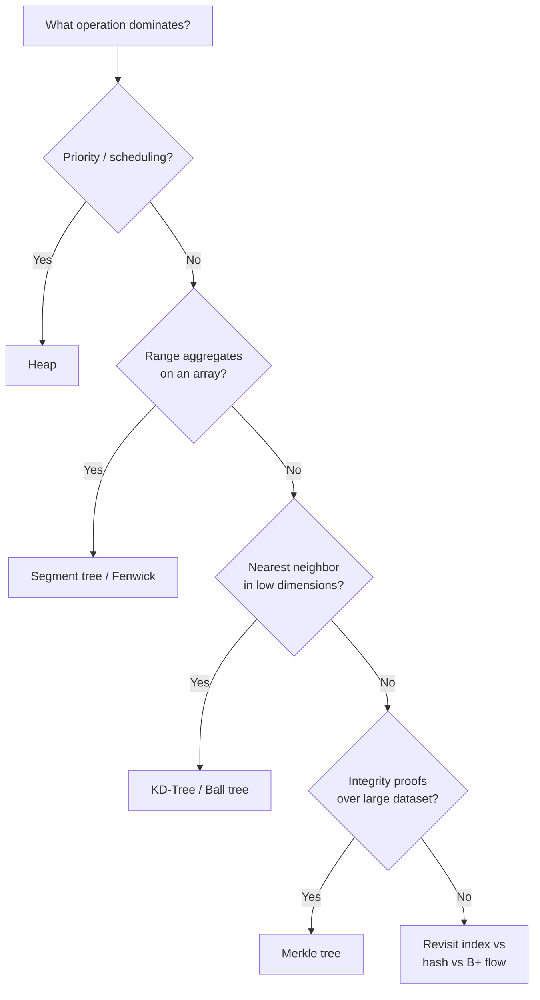
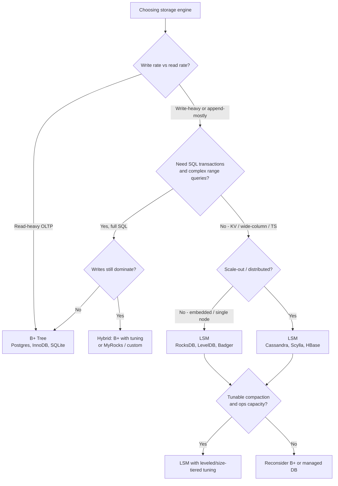

# Decision Guides and Cheat Sheets

Practical flows for choosing tree and index structures by workload.

> **Related:** Amplification & complexity → [§6](06-amplification-and-related-topics.md) · PostgreSQL indexes → [postgresql-performance §2](../../postgresql-performance/includes/02-indexing.md) · Write-heavy workloads → [§4 LSM](04-lsm-trees.md)

---

## Scenario cheat sheet

| Scenario | Recommended structure |
|----------|----------------------|
| SQL(Structured Query Language) index, pagination, `BETWEEN` | B+ Tree |
| Only `WHERE id = ?`, no sort | Hash index / hash table |
| In-app ordered map | Red-Black Tree (default) or AVL (lookup-critical) |
| Autocomplete / IP longest prefix | Trie or Radix tree |
| Job scheduler / event queue | Heap |
| Sum of values in index `[L..R]` | Fenwick or Segment tree |
| Points in a map rectangle | R-Tree |
| Closest point in 2D/3D | KD-Tree |
| Verify file/block without full download | Merkle tree |
| Filesystem directory metadata | B-Tree variants (ext4, NTFS) |
| Write-heavy logs, metrics, KV at scale | LSM(Log-Structured Merge) Tree |
| Read-heavy OLTP(Online Transaction Processing) with complex queries | B+ Tree |

---

## Flow 1 — Storage layer (disk / database index)

---

## Flow 2 — In-memory ordered map

---

## Flow 3 — Query type (specialized structures)

---

## Flow 4 — LSM vs B+ Tree (storage engine)

---

## Master comparison — storage indexes

| Dimension | B+ Tree | LSM Tree | Hash |
|-----------|---------|----------|------|
| Point lookup | O(log n) I/O | Memtable + files | O(1) avg |
| Range scan | Excellent | Good (leveled) | None |
| Write throughput | Moderate | Very high | High (in memory) |
| Read predictability | High | Can vary | High (avg) |
| On-disk fit | Native | Native | Harder |
| SQL OLTP default | ✅ | Rarely primary | Equality only |

---

## Rule-of-thumb summary

1. **One node ≈ one I/O unit** → B+ Tree
2. **Everything in RAM, need ordered map** → Red-Black or AVL
3. **Append-mostly, write-heavy, KV/TS at scale** → LSM Tree
4. **Equality only, no ordering** → Hash
5. **Prefix on strings** → Trie / Radix
6. **Spatial bounding boxes** → R-Tree
7. **Min/max or scheduling** → Heap

## Common mistakes

| Mistake | Fix |
|---------|-----|
| LSM for small read-heavy SQL app | B+ tree (default RDBMS) |
| B+ tree for append-only metrics at scale | LSM (RocksDB, Cassandra) |
| Red-black tree persisted to disk as primary index | B+ tree storage engine |
| Hash index when `ORDER BY` required | B+ tree |
| Skip decision guide and pick trendy engine | Match structure to access pattern |

---

## See also

- Common mistakes and when NOT to use → [06-amplification-and-related-topics.md](06-amplification-and-related-topics.md)
- PostgreSQL-specific index types → [postgresql-performance/includes/02-indexing.md](../../postgresql-performance/includes/02-indexing.md)