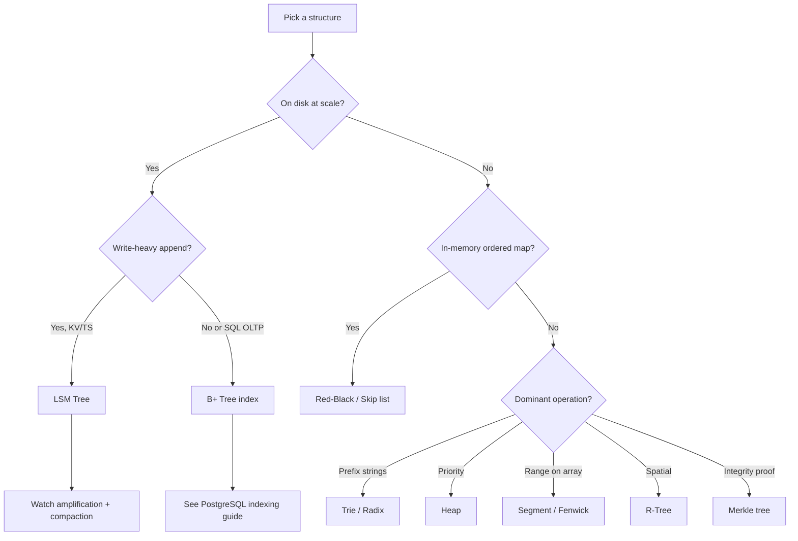

# Amplification, Complexity, and Related Topics

Storage-engine metrics, clustered indexes, complexity reference, common mistakes, and links to deeper guides elsewhere in this repo.

> **Scope:** **Cross-structure comparison** — read/write/space amplification, clustered indexes, complexity table. PostgreSQL index pickers → [postgresql-performance §2 Indexing](../../postgresql-performance/includes/02-indexing.md) and [§13 decision guide](../../postgresql-performance/includes/13-decision-guide-and-common-mistakes.md).
>
> **Related:**
> - PostgreSQL index types and when to use each → [postgresql-performance/includes/02-indexing.md](../../postgresql-performance/includes/02-indexing.md)
> - PostgreSQL decision guide → [postgresql-performance/includes/13-decision-guide-and-common-mistakes.md](../../postgresql-performance/includes/13-decision-guide-and-common-mistakes.md)
> - Database access and credentials → [database-connection-and-security/README.md](../../database-connection-and-security/README.md)

---

## Amplification framework (B+ vs LSM)

Storage engineers compare engines with three metrics. Lower is better for each — but you rarely get all three low at once.

| Metric | What it means | B+ Tree | LSM Tree |
|--------|---------------|---------|----------|
| **Read amplification** | Bytes (or I/Os) read per logical read | Low — ~tree height page reads | Higher — memtable + multiple SSTables + Bloom false positives |
| **Write amplification** | Bytes written to disk per logical write | Moderate — page splits, WAL(Write-Ahead Log) | High — compaction rewrites data repeatedly |
| **Space amplification** | Extra disk vs logical data size | Moderate — page fill, bloat until VACUUM | Higher until compaction — tombstones, L0 overlap, old versions |

**Takeaway:** B+ trees optimize **steady reads and range scans**. LSM trees optimize **write ingest** and accept higher read/write/space amplification unless compaction is tuned.

See also → [04-lsm-trees.md](04-lsm-trees.md) (LSM pros/cons), [01-b-trees-and-b-plus.md](01-b-trees-and-b-plus.md) (B+ on disk).

---

## Clustered vs secondary index (B+ tree engines)

In **InnoDB**, **SQL(Structured Query Language) Server clustered index**, and similar engines:

| Type | Leaf contains | Lookup cost |
|------|---------------|-------------|
| **Clustered index** | Full row data (table sorted by PK) | One B+ tree descent |
| **Secondary index** | Index key + pointer to clustered key | Two descents — index tree, then clustered tree |

**Implications:**

- Primary key choice matters — it is the physical row order.
- Wide secondary indexes on write-heavy tables multiply B+ write cost.
- Covering indexes (index-only scans) avoid the second lookup when all columns are in the index — see [PostgreSQL covering indexes](../../postgresql-performance/includes/02-indexing.md).

---

## Complexity cheat sheet

| Structure | Search | Insert | Delete | Range scan |
|-----------|--------|--------|--------|------------|
| **B+ Tree** (disk) | O(log n) I/O | O(log n) I/O | O(log n) I/O | Excellent (leaf chain) |
| **LSM Tree** | O(log n) + files | O(1) amortized append | Tombstone + compaction | Good (leveled) |
| **Hash index** | O(1) avg | O(1) avg | O(1) avg | None |
| **Red-Black / AVL** | O(log n) | O(log n) | O(log n) | In-order O(n) |
| **Skip list** | O(log n) avg | O(log n) avg | O(log n) avg | Sorted iteration O(n) |
| **Trie / Radix** | O(key length) | O(key length) | O(key length) | Prefix O(prefix + matches) |
| **Heap** | — (not keyed) | O(log n) | O(log n) | Not ordered by key |
| **Segment / Fenwick** | Range O(log n) | Point O(log n) | Point O(log n) | By design |

---

## When NOT to use

| Structure | Skip when |
|-----------|-----------|
| **B+ Tree index** | Table is tiny (seq scan wins); equality-only with no sort (hash may win); write-heavy with many redundant indexes |
| **Hash index** | You need `ORDER BY`, `BETWEEN`, or prefix search |
| **LSM engine** | Read-heavy OLTP with complex SQL; heavy in-place UPDATE on same keys; you cannot tune compaction |
| **Trie** | Keys are dense random strings (UUIDs) with no prefix locality — use hash or B+ |
| **Red-Black / AVL in app** | Data is on disk at scale — use the DB’s B+ index instead of loading into memory |
| **R-Tree alone** | High-dimensional vectors (k > ~10) — consider specialized ANN(Approximate Nearest Neighbor) indexes |
| **Segment tree** | You need a general mutable key-value store — wrong tool |

---

## Common mistakes

| Mistake | Why it fails | Do instead |
|--------------|--------------|------------|
| Hash index when queries need `ORDER BY` | Hash has no ordering | B+ tree (or sort in app with small sets) |
| LSM for read-heavy OLTP without compaction tuning | Read amplification, latency spikes | Default B+ RDBMS; or leveled LSM + monitoring |
| Trie for random UUID(Universally Unique Identifier) keys | Huge node count, no prefix benefit | B+ or hash on UUID |
| B+ mental model for in-RAM `std::map` | Optimizes pages, not cache lines | Red-Black / AVL / skip list in process |
| Too many secondary indexes on hot write path | Every INSERT/UPDATE touches each index | Index only proven query patterns; partial indexes — [PostgreSQL indexing](../../postgresql-performance/includes/02-indexing.md) |
| Choosing LSM for “fast deletes” | Space not reclaimed until compaction | Plan TTL(Time To Live) + compaction; or B+ with routine maintenance |
| Using heap for keyed lookup | Heaps are not search trees | Map/set or DB index |
| GiST/R-Tree for non-spatial JSON | Wrong index family | GIN(Generalized Inverted Index) for JSONB — [PostgreSQL indexing](../../postgresql-performance/includes/02-indexing.md) |
| Ignoring clustered vs secondary cost | Hidden double lookup on wide secondaries | Covering index, narrower secondary keys, or PK redesign |

---

## PostgreSQL index type map (tree-adjacent)

PostgreSQL uses several index access methods. Not all are B-trees:

| PG type | Underlying idea | When to use |
|---------|-----------------|-------------|
| **B-tree** (default) | B+ style | Equality, ranges, sort, most FKs |
| **Hash** | Hash table | Equality only; rare in practice |
| **GIN** | Inverted index | JSONB `@>`, full-text, arrays |
| **GiST / SP-GiST** | Generalized search trees | PostGIS, ranges, NN |
| **BRIN(Block-Range Index)** | Block range summaries | Very large, naturally ordered columns |

Full detail → [postgresql-performance/includes/02-indexing.md](../../postgresql-performance/includes/02-indexing.md)

---

## Priority checklist

If you only remember five things:

1. **On disk, ordered access** → B+ tree (or engine default B-tree index)
2. **Equality only, no sort** → hash (if supported)
3. **Write-heavy append / KV at scale** → LSM — but plan compaction
4. **In RAM ordered map** → Red-Black (default) or skip list (concurrency)
5. **Measure before adding indexes** → [PostgreSQL measurement](../../postgresql-performance/includes/01-measurement.md)

---

## Glossary

| Term | Meaning |
|------|---------|
| **Fanout** | Number of children or keys per node; higher → shallower tree |
| **SSTable** | Immutable sorted file on disk (LSM) |
| **Memtable** | In-memory write buffer flushed to SSTables |
| **Tombstone** | Delete marker in LSM; removed at compaction |
| **Compaction** | Background merge of LSM SSTables |
| **Read / write / space amplification** | Extra I/O or disk vs logical operation size |
| **Clustered index** | Index whose leaves store full row data |
| **Covering index** | Index containing all columns a query needs (index-only scan) |
| **Bloom filter** | Probabilistic “definitely not in file” shortcut (LSM reads) |

---

## Master decision overview

